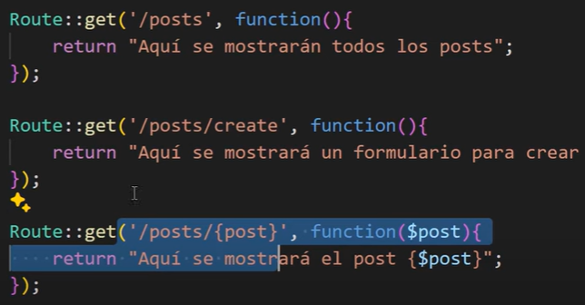

# Laravel-Ejemplo
En este repositorio se realizaran practicas y ejemplos para aprender Laravel

# CARPETAS
## routes
Sirve para crear las rutas y asignarles vistas(views)
Las rutas se leen de arriba hacia abajo

### peticiones
-GET: Sirve para que el usurio pida recursos (redireccionar a una pagina)
-POST: Sirve para enviar recursos
-PUT: Sirve actualizar registros
-PATCH: Sirve actualizar registros
-DELETE: Sirve eliminar registros

## views
Sirve para crear las vistas para el usuario

# ARCHIVOS